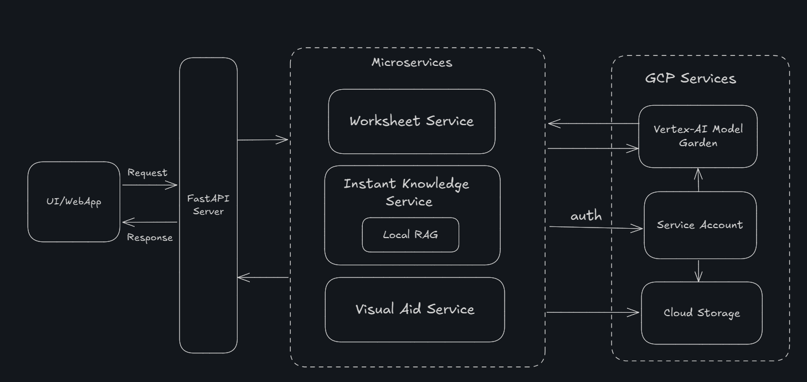

# VidyaNav-ai Backend

Sahayak - AI teaching assistant for multi-grade students in rural areas of India.

## Related Repositories
- Frontend: https://github.com/AnishNavalgund/vidyaNav-ai-frontend
- Backend (This): https://github.com/AnishNavalgund/vidyaNav-ai-backend

## Overview
VidyaNav-ai is an AI-powered backend service designed to assist teachers in rural Indian schools. It provides:
- **Worksheet generation** from textbook images for multiple grades and languages. Upload a textbook image and generate simple, age-appropriate worksheets for selected grades and language.
- **Instant knowledge Q&A** from uploaded textbooks (PDFs) using local Retrieval-Augmented Generation (RAG). Upload a textbook PDF and ask questions; get simple, analogy-rich answers suitable for students with AI confidence score
- **Visual aid generation** for creating chalkboard-style educational diagrams for classroom use. Generate educational diagrams for classroom topics, tailored for blackboard use.

## Feat
The project is completely done using **Google AI Ecosystem**. 

## Architecture
A high-level architecture of the prototype.



## Design Decisions
1. Microservice Structure: Each feature is independent, importable and scalable.
2. Central entrypoint: `app/main.py` is the central entrypoint for all the features making it easy to add new features.
3. LLM and Embedding Models: These were the chosen Gemini models available from Vertex AI. 
 - Text Gen: `gemini-2.5-flash` and `gemini-2.0-flash-lite`
 - Embedding: `text-embedding-004`
 - Image Gen: `imagen-3.0-fast-generate-001`
4. RAG: Chose to implement locally with embedding, similarity and chunking. Just for prototype.  
5. File Storage: Google Cloud Storage is used to store the user uploaded files temporarily.
6. Pydantic-AI is used for structured responses. 
7. Containarising using Docker for easy and cloud/hardware-independentdeployment.
8. For frontend, the UI was done using **Google Firebase Studio** for quick prototyping and backend demo purposes. 

## Tech Stack
- Python 3.10
- FastAPI
- Google Cloud Vertex AI, Storage
- Docker, Docker Compose
- Poetry (dependency management)
- Pydantic-AI, Vertex AI Imagen, Vertex AI Gemini

## Project Structure
```
├── app/                        # FastAPI application (main entrypoint)
│   └── main.py                 # API endpoints
├── worksheet_service/          # Worksheet generation Service
├── instantknowledge_service/   # Instant knowledge Service
├── visualaid_service/          # Visual aid generation Service
├── utils/                      # Utility modules (e.g., file upload)
├── scripts/                    # test scripts (playground)
├── creds.json                  # Google Cloud service account credentials (not committed)
├── .env.example                # Environment variables 
├── .env.docker.example         # Environment variables for Docker 
├── pyproject.toml              # Poetry project file
├── Dockerfile                  # Docker build file
├── docker-compose.yml          # Docker Compose setup
├── docs/                       # Documentation
└── README.md                   # This file
```

## Setup Instructions

### 1. Prerequisites
- Python 3.10 and Poetry
- Google Cloud project with Vertex AI and Storage enabled. Tutorial at `docs/google-cloud-setup.md`

### 2. Clone the Repository
```bash
git clone https://github.com/AnishNavalgund/vidyaNav-ai-backend.git
cd vidyaNav-ai-backend
```

### 3. Install Dependencies (Local Dev)
```bash
poetry install
```

### 4. Environment Variables
- Create `.env` and `.env.docker` files in the root as per examples. 

### 5. Run Locally
```bash
uvicorn app.main:app --reload
```

## Deployment
- Deployment is done using Docker Compose. For the first time:
```bash
docker-compose up --build
```
and then, just `docker compose up` after that.
The API will be available at `http://localhost:8080`.

## Frontend
- Run the frontend server as mentioned in the [frontend repository](https://github.com/AnishNavalgund/vidyaNav-ai-frontend)
- Refer its README for more details.

## Next Steps
1. Add Database Support: Integrate Cloud SQL to store user and request metadata.
2. Vector Database for RAG: Use ChromaDB or Pinecone for semantic search across textbook chunks.
3. TTS: Add TTS to the backend for audio generation.
4. Add Unit Tests: Implement mock-based tests for all services. 
5. Setup CI/CD: Configure GitHub Actions for automated testing, building, and deployment workflows.
6. Take care of linting and formatting (black, isort)
7. Deployment: Deploy services to Google Cloud Run and frontend to Firebase Hosting / Vercel

## Contact
Email: anishk.navalgund@gmail.com